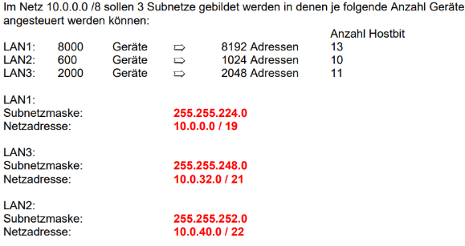
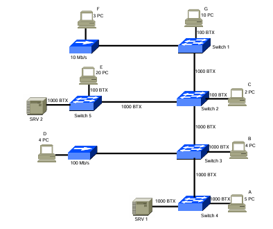

# Theorie
### Modul 129

*24.02.2026*
## IP-basierte Kommunikation
Die Basis der IP-basierten Kommunikation, die vor allem im zivilen Sektor zahlreiche andere Technologien abgelöst hat und eine der wichtigsten Säulen der globalen Vernetzung darstellt, wurde durch das ARPANet gelegt. Dieses Netzwerk, das ab 1968 im Auftrag der US Air Force entwickelt wurde, ebnete den Weg für die digitale Revolution. ARPANet, der Vorläufer des heutigen Internets, spielte eine entscheidende Rolle bei der Entwicklung des Internetprotokolls (IP), das heute die Grundlage für den Austausch von Daten über das weltweite Netz bildet.

## IMP / Interface Message Processor
Der Interface Message Processor (IMP) war der Knotenpunkt für Paketvermittlung, der zur Verbindung von Teilnehmernetzwerken mit dem ARPANET von den späten 1960er Jahren bis 1989 verwendet wurde. Er war quasi der erste Router.

## ARP
Mit dem ARP-Protokoll kann ein Host die MAC-Adresse eines anderen Hosts herausfinden. Dies ist notwendig, um anschliessend per IPv4 kommunizieren zu können. Es wird über den Broadcast von Host A die Nachricht abgesetzt, dass man erfahren möchte, wer eine spezifische IP-Adresse hat. Der Host B, derjenige mit dieser IP-Adresse, antwortet mit seiner MAC-Adresse. Host A, welcher die Anfrage gesendet hat, erstellt bei sich einen Eintrag mit der Kombination von IP-Adresse und MAC-Adresse. Nun kann er mit Host B über IPv4 kommunzieren.

## IP-Adressen berechnen

*Nehmen wir die IPv4-Adresse 192.168.6.4/24 und beantworten dazu, die relevanten Fragen:*

*Ist die vorliegende IPv4-Adresse eine Netz-, Broadcast- oder Host-Adresse?*
*Wie lautet die Netzadresse?*
*Wie lautet die Broadcast-Adresse?*
*Wie viele Hosts können adressiert werden?*
*Welche IPv4-Adressen stehen für die Host-Adressierung zur Verfügung?*

### Schritt 1: IPv4 Adresse in binäre Form umwandeln
Address:   192.168.6.4          11000000.10101000.00000110. 00000100

### Schritt 2: Netzmaske und Wildcard in binäre Form umwandeln
Netmask:   255.255.255.0 = 24   11111111.11111111.11111111. 00000000
                                <=        24 Eins       =>
Wildcard:  0.0.0.255            00000000.00000000.00000000. 11111111
                                                            <8 Eins>
                                24 Bits + 8 Bits = 32 Bits = 4 Bytes

### Schritt 3: Logisch UND (&) mit der IPv4-Adresse & Netzmaske ergibt Netzadresse
Address:   192.168.6.4          11000000.10101000.00000110. 00000100
 & Netmask:   255.255.255.0     11111111.11111111.11111111. 00000000
 = Network:   192.168.6.0/24    11000000.10101000.00000110. 00000000

### Schritt 4: Netzmaske + 1 ergibt HostMin
Network:   192.168.6.0/24       11000000.10101000.00000110. 00000000
+ 1                             00000000.00000000.00000000. 00000001
= HostMin:   192.168.6.1          11000000.10101000.00000110. 00000001

### Schritt 5: Netzmaske & Wildcard = Broadcast
Network:   192.168.6.0/24       11000000.10101000.00000110. 00000000
& Wildcard                      00000000.00000000.00000000. 11111111
 = Broadcast: 192.168.6.255     11000000.10101000.00000110. 11111111

### Schritt 6: Broadcast - 1 ergibt HostMax
Broadcast: 192.168.6.255     11000000.10101000.00000110. 11111111
 -1                          00000000.00000000.00000000. 00000001
 = HostMax: 192.168.6.254    11000000.10101000.00000110. 11111110

### Schritt 7: Anzahl möglicher Hosts bestimmen: 2^(32-CIDR) -2 = Anzahl Hosts
2^(32-24) - 2 = 254

## Hostmaximum in einem Subnetz berechnen
Wieviele Hosts in ein Netz passen kann mit der folgenden Formel berechnet werden:
Hosts = **2^(Host-Bits) - 2**  
Die Minus zwei entsteht durch den Broadcast und die Netzadresse.

**Beim Subnetting sollen stehts nur so viele Adressen freigegeben werden wie nötig**  

Beispiel:  

### Auflistung möglicher Hosts bei den entsprechenden Netzmaske

CIDR	Subnetzmaske	Host-Bits	Nutzbare Hostscc
/10	    255.192.0.0	    22	        4,194,302  
/11	    255.224.0.0	    21	        2,097,150  
/12	    255.240.0.0	    20	        1,048,574  
/13	    255.248.0.0	    19	        524,286  
/14	    255.252.0.0	    18	        262,142  
/15	    255.254.0.0	    17	        131,070  
/16	    255.255.0.0	    16	        65,534  
/17	    255.255.128.0	15	        32,766  
/18	    255.255.192.0	14	        16,382  
/19	    255.255.224.0	13	        8,190  
/20	    255.255.240.0	12	        4,094  
/21	    255.255.248.0	11	        2,046  
/22	    255.255.252.0	10	        1,022  
/23	    255.255.254.0	9	        510  
/24	    255.255.255.0	8	        254  
/25	    255.255.255.128	7	        126  
/26	    255.255.255.192	6	        62  
/27	    255.255.255.224	5	        30  
/28	    255.255.255.240	4	        14  
/29	    255.255.255.248	3	        6  
/30	    255.255.255.252	2	        2  
/31	    255.255.255.254	1	        0*  
/32	    255.255.255.255	0	        1  

## Mögliche Subnetz bei zusätzlichen Bits in der Subnetzmaske
**Anzahl Subnetze = 2^(zusätzliche Bits)**

Beispiel: /3 = 8 mögliche Subnetze  
000  
001  
010  
011  
100  
101  
110  
111  

## Bandbreite

Bandbreiten können anhand der maximalen Leistung einer Leitung und der Anzahl PCs die diese "Strecke" benutzen wollen, berechnet werden.  

In dem oben zu sehenden Beispiel, kann ein PC von C die maximale Geschwindigkeit von 100 BTX benutzen, wenn er SRV 2 erreichen will. Ein PC von B ist nicht so eingeschränkt und kann eine maximale Geschwindigkeit von 1000 BTX nutzen.
Wenn nun alle PCs von B mit dem SRV 2 kommunizieren und einer von C, muss die Geschwindigkeit von Switch 5 zu SRV 2 aufgeteilt werden.   

Es werden also 1000 BTX durch 5 PCs geteilt. Dies ergibt für jeden PC 200 BTX. Dies trifft jedoch nur für die PCs von B zu, da sie ein maximum von 1000 BTX haben. Das Gerät von C hat jedoch das Limit von 100 BTX und kann deshalb nur eine Leistung von 100 BTX nutzen, obwohl im 200 zuständen.

1000 BTX : 5 = 200 BTX/PC  
PCs von B = 200 BTX  
PC von C = 100 BTX --- Er ist durch seine Verbindung zum Switch 2 limitiert.

## Switch und Routingtabellen

Es folgen die Regeln für die jeweiligen Tabellen  

### Für die Switchtabelle

Eintragen:  
jede MAC-Adresse  
auf dem Port, an dem das Gerät angeschlossen ist  

Switches kennen keine Routen.

